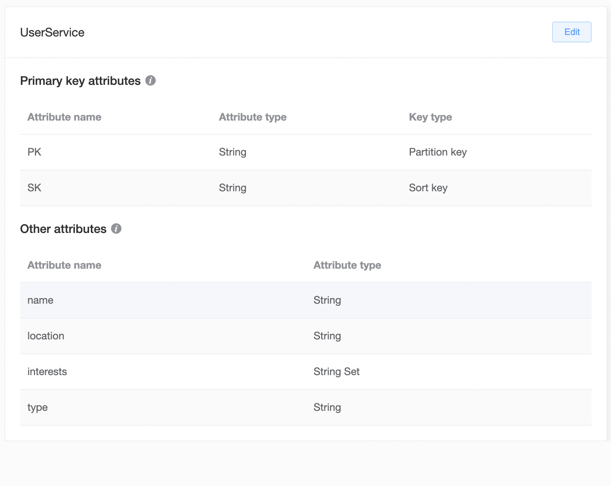

# User Service

As the [Mermaid](https://mermaid.js.org/syntax/entityRelationshipDiagram.html) ERD below shows, this User Service deals with Users and Groups. Users may belong to zero or more groups, and a group may have zero or more users.

Since we're going to store this data in a DynamoDB database, and we have a many-to-many relationship, we're going to follow best practices as [described by AWS](https://docs.aws.amazon.com/amazondynamodb/latest/developerguide/bp-adjacency-graphs.html) for many-to-many relationships. 

To help with modeling this data in DynamoDB, we'll use the [NoSQL Workbench](https://docs.aws.amazon.com/amazondynamodb/latest/developerguide/workbench.html) provided by AWS. You can get a peek at where the data model discussed here lands at the end of this post, by downloading the workbench, and importing [this file](./workbench.json).

First, we define the data model:

Notice the `type` field above, which is not in the ERD. This is useful as part of single-table design. It is especially helpful if you're using a type system in whatever programming language you're using to interact with the data. Many [ORM](https://en.wikipedia.org/wiki/Object%E2%80%93relational_mapping)s will automagically pick up on the `type` key to decide what Type to use when structuring an item out of the database.

I should also point out that the only fields that are actually required as part of our DynamoDB table definition are `SK` and `PK`, as they are our primary key attributes. Defining them all here is necessary for using the NoSQL Workbench, but not for using DynamoDB itself.

Now we can go ahead and enter some data using the workbench.

Let's talk about what's going on in this screenshot.

Here we can see `Index Overloading` at play. That refers to the ability to have more than one type of data accessible through the same index. In our case, we're talking about the primary index, but we can use Index Overloading with secondary indexes as well.

Something else to note is that we are currently using the same value for the `PK` and the `SK`. This is one way of modeling a record that contains the metadata about a certain object itself, as opposed to a record that describes the relationship between more than one object. I've also seen people use a literal `A` for the `SK` of these records, or possibly the word `META`. I'm still learning what the pros and cons are for these various options, and have chosen to go this route for now. I may learn more and change that up in the future. I may adopt the `A` approach, as it causes that top-level record (as I think of it) to appear at the top of a list of records when sorted alphabetically by SK, which is the default sort.

Now that we have our top-level records in the database, we should stop and consider our use cases. Honestly, we probably should have thought about them alongside our ERD at the beginning, but with this simple case, I believe we're safe waiting until this point. It's pretty safe to assume we'll need to access both users and groups directly by their respective primary key.

Let's consider how users and groups relate to each other. Users can be in groups, and groups can have users. We have options for how to model these relationships. The ones we are going to discuss here make use of the [Adjacency List Pattern](https://www.youtube.com/watch?v=k1wraWzqtvQ&t=924s) suggested in the best practices document referenced earlier.

To represent the fact that `USER#1` is a member of `GROUP#1`, we need both of those values on a single record in our table. One value needs to be the `PK`, and the other needs to be the `SK`. If we put `USER#1` in the `PK` column, and `GROUP#1` in the `SK`, then we will be able to retrieve a user and all of that user's groups with a simple query of our table against the primary index where `'PK' == 'USER#1'`. If we have a user form on our web page where we choose groups for a user, then we are guaranteed that a newly added group will be returned in a query for the user's groups immediately after creating the joiner record. This is considered a [Strongly Consistent](https://docs.aws.amazon.com/amazondynamodb/latest/developerguide/HowItWorks.ReadConsistency.html) read of the database. 

If, however, we will be on a group edit page when adding users to groups, then our current data model will not be sufficient to efficiently query the users in our group immediate after adding a new user. Our query for the group's partition key will not give us the users directly. We'll either have to scan the table for them, or we'll need a [Global Secondary Index](https://docs.aws.amazon.com/amazondynamodb/latest/developerguide/GSI.html) that uses `SK` as the partition key and `PK` as the sort key. The problem with a GSI is that a query against it will be [Eventually Consistent](https://docs.aws.amazon.com/amazondynamodb/latest/developerguide/HowItWorks.ReadConsistency.html), and so may not return the newly added user immediately after the call to add it. 

> When I started this blog series, my plan had been to introduce a `ReverseLookup` GSI here, which flips the role of the `PK` and `SK`, but now that I'm here, that doesn't seem sufficient. It seems likely that an app would allow you to choose groups for a user from the user edit page as well as allowing you to choose users for a group from the group page. In neither of those cases would an eventually consistent read immediately after adding a new entry be ideal. 

> The solution seems to be to go ahead and add two joiner records in the same transaction using DynamoDB's [TransactWriteItems](https://docs.aws.amazon.com/amazondynamodb/latest/developerguide/transaction-apis.html) api. I'm going to pivot from my original plan, and suggest that here.

Since we're assuming we'll need to access groups via a given user, as well as access users via a given group, we're just going to go ahead and write two joiner records per relationship. I generally avoid having two sources of truth for one fact, but, as usual, we have tradeoffs to consider. Since I can rely on the fact that I can write or remove both joiner records in a single transaction, I feel okay with going this direction. It makes me feel a bit itchy, but at least I can come at the data both directions and rely on consistent reads both ways.

Let's go back to the workbench and see what our data shows us after adding these joiner records.

> I've decided to add a `joined_at` field to the joiner or "edge" records to show what it looks like to have metadata on one of those records. Sometimes we have information like this that is not specific to either entity, but rather to the relationship between them. This may make me regret the decision to write two joiner records for a single relationship, as it increases the risk associated with the same data being stored in two places. The fact that the joiner records will be written in a single transaction may still make the choice tenable. We shall see. 

In the following two examples, you can see what we would get if we queried our primary index for `'PK' == 'USER#1'` or `'PK' == 'GROUP#2'`.

In this image, you can see that we get the information about the `USER#1` user in the `User` record, and each group the two groups that user is belongs to in the two `UserGroup` joiner records. 

Similarly here, when querying for `GROUP#2`, we get the `Group` record,  and the three `GroupUser` joiner records.

You may notice that these images that the `User` record appears at the bottom of the list for the `USER#1` `PK`, but the `Group` record appears at the top when we query for `GROUP#2`. As I mentioned earlier, this is why some people prefer to use `A` for the `SK` for those records. 

Let's go ahead and see what that would look like:

It is kind of nice having the main entity record sorted at the top, regardless of how the `Type` for the record is spelled. I think I'll run with it this way for a while and see what I think. It's just a blog exercise, so it's low risk to be wrong. Unless some trolls read this... but you can't make everyone happy, so what the heck. Let's roll with it.

So, how far should I go before we consider part 1 done? Let's see if we can actually get some data into a local dynamodb database so you can see how to actually work with it.

We're already using the NoSQL Workbench, and it appears to have a way of spinning up a local dyanmodb database, and can add data to it, so let's see if we can make that work.

First, I'm hitting the little toggle to hopefully start a local db.

Bummer. Didn't work:

It turns out I had PHP running on port 8000: 

Once I killed the php process, and hit the `DDB Local Server` button again, the local database appears to have started.

Now I'm going to attempt to use this button:

Well. I tried sticking with the `default` connection in the modal that popped up after hitting that button. It was successful, but it put the data into my developer AWS account for work. That was not my intent. I think I'll create a new database instead.

That appears to have worked as well. Now, how do I query that local database?...

Maybe this `open` button will help:

Indeed, it did. From there, I could query the data either using [PartiQL](https://docs.aws.amazon.com/amazondynamodb/latest/developerguide/ql-reference.html)

Or I could opt to use the workbench interface.

Both options gave me back data. Here are the results of the above example. I get all of the groups for the queried user.

I think this is a good place to stop for now. If you want to try this for yourself, download the [NoSQL Workbench](https://docs.aws.amazon.com/amazondynamodb/latest/developerguide/workbench.html), and import the [workbench.json](./workbench.json) file I exported for you.

In part 2 of this series, we'll see if we can do something more interesting with this data. I think I may introduce the concept of rules that will automatically add a user to a group when a new user is created. I think that will give me an opportunity to write about my love for [Imperative Shell / Functional Core](https://www.destroyallsoftware.com/screencasts/catalog/functional-core-imperative-shell), and to possibly talk about [Generators in Python](https://wiki.python.org/moin/Generators), which is what I thought my very first post was going to be about.

At some point in this series, we may even make use of the [Serverless Framework](https://www.serverless.com/), [DynamoDB Streams](https://docs.aws.amazon.com/amazondynamodb/latest/developerguide/Streams.html) and [Lambda Functions](https://docs.aws.amazon.com/lambda/latest/dg/welcome.html).